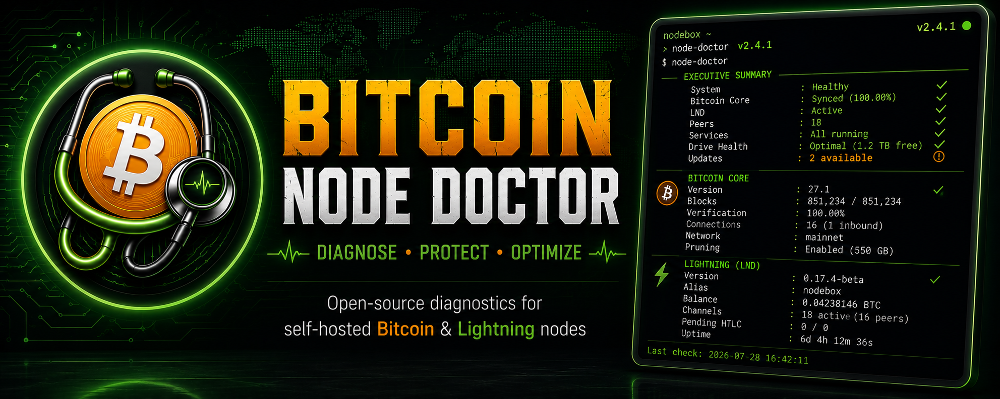
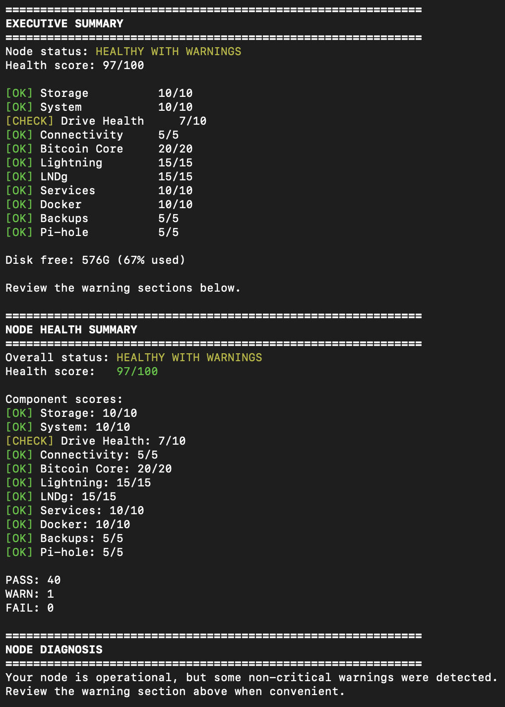
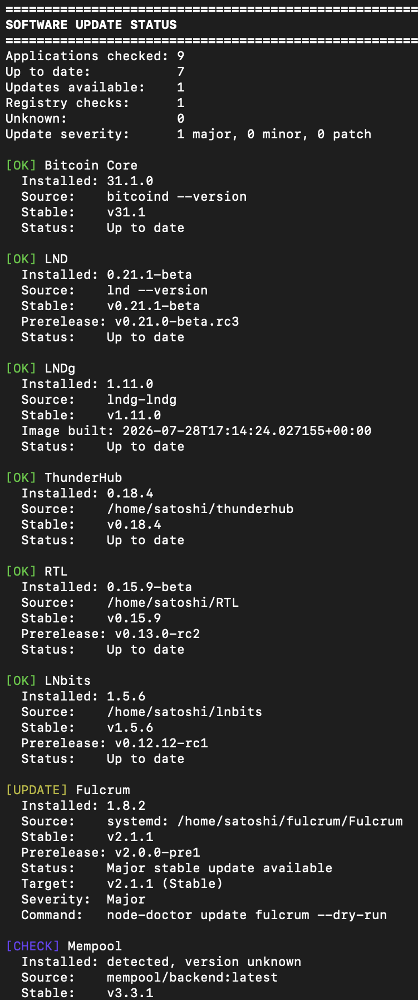
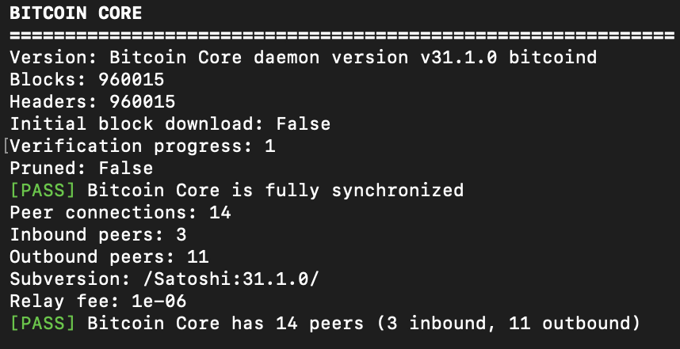
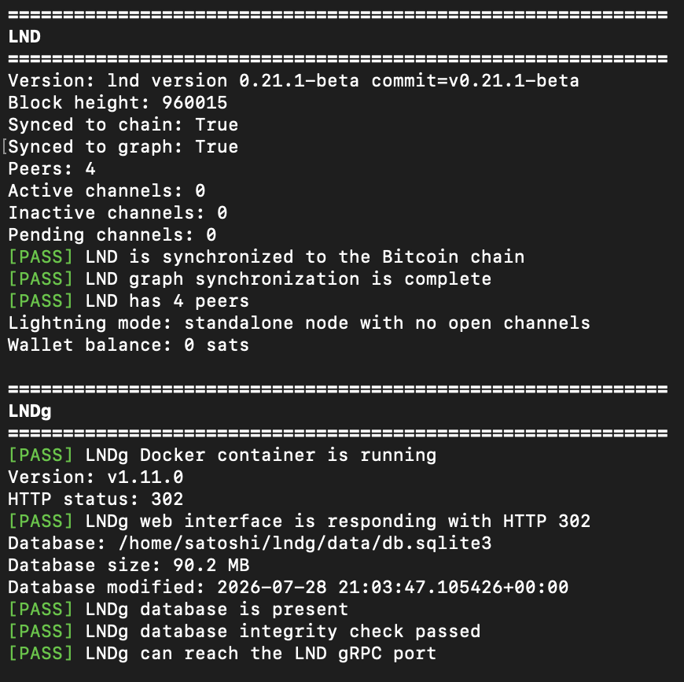
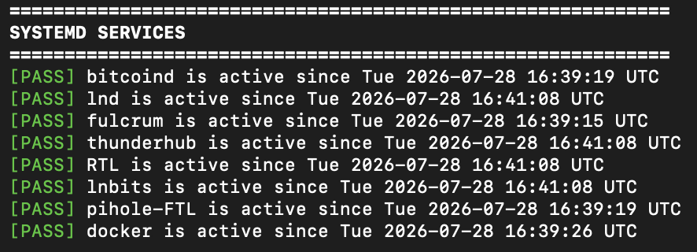
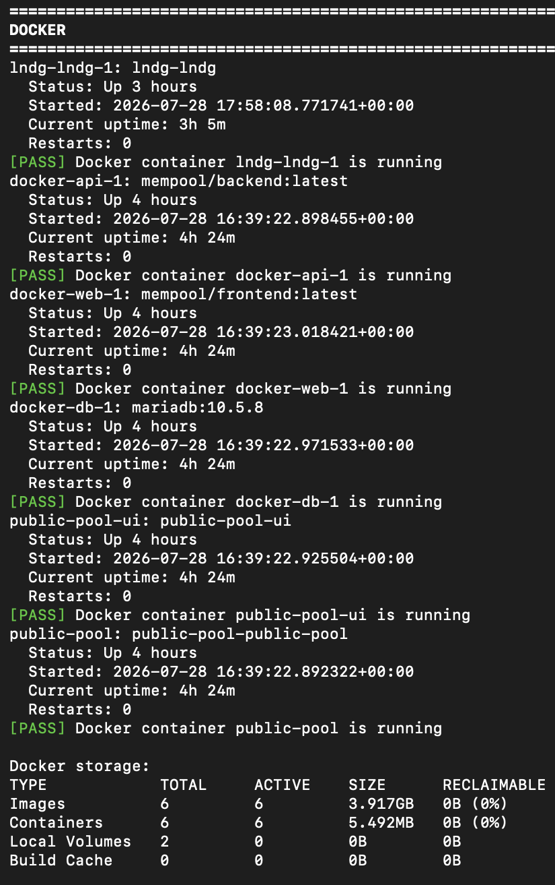
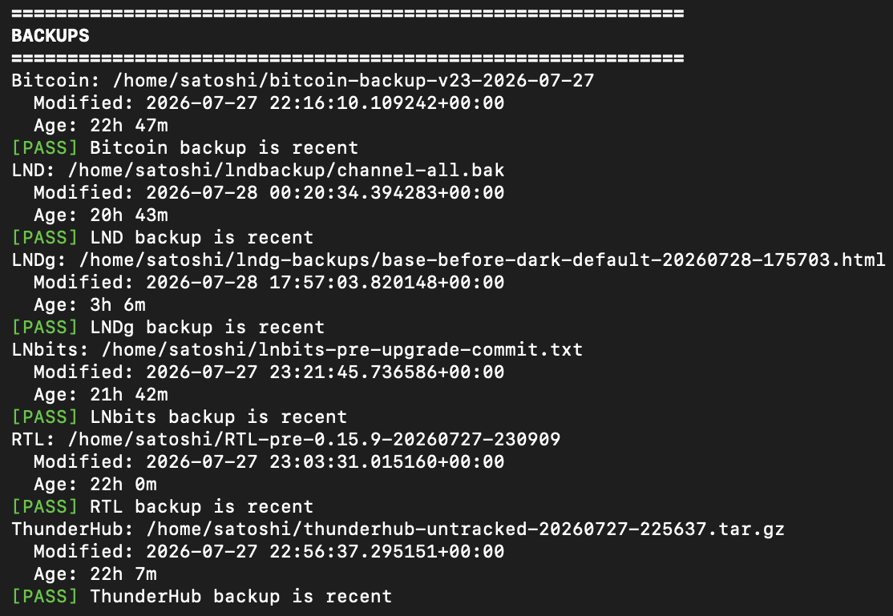
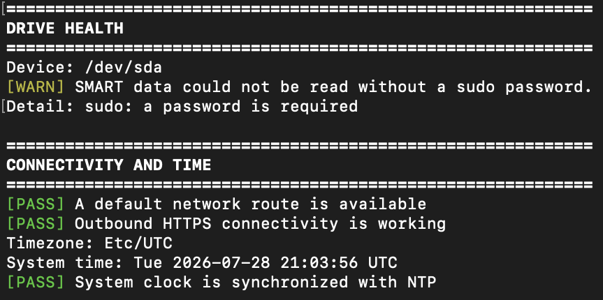

<p align="center">
  
</p>


<h1 align="center">
Bitcoin Node Doctor
</h1>

<p align="center">
Diagnose • Protect • Optimize
</p>
<p align="center">


</p>
<p align="center">

A comprehensive health and diagnostic utility for self-hosted Bitcoin and Lightning nodes.

</p>
## Contents

- Features
- Executive Summary
- Software Updates
- Bitcoin Core Diagnostics
- Lightning Diagnostics
- Docker
- Services
- Backups
- Drive Health
- Installation
- License


## Features

- Automatic software update detection
- Bitcoin Core health checks
- Lightning Network diagnostics
- Docker container inspection
- systemd service monitoring
- Backup verification
- Storage utilization
- Memory and CPU statistics
- Beautiful colorized terminal output
- No external dependencies beyond Python


---

## Executive Summary



---

## Software Update Assistant

Checks installed software against the latest available releases.



---

## Bitcoin Core Diagnostics

Displays synchronization status, peers, pruning configuration, and blockchain health.



---

## Lightning Diagnostics

Displays LND status, balances, channels, and connectivity.



---

## Service Monitoring

Displays the status of important systemd services.



---

## Docker Inspection

Shows running containers and Docker health.



---

## Backup Verification

Verifies backups exist and reports their age.



---

## Storage & Drive Health

Displays filesystem usage and available disk space.



---

## Installation

## Installation

Clone the repository:

```bash
git clone https://github.com/almostheaven1863/bitcoin-node-doctor.git
```

Run the installer:

```bash
cd bitcoin-node-doctor

./install.sh
```

---

## Supported Software

| Software | Supported |
|-----------|-----------|
| Bitcoin Core | ✅ |
| LND | ✅ |
| RTL | ✅ |
| ThunderHub | ✅ |
| LNbits | ✅ |
| Fulcrum | ✅ |
| Mempool | ✅ |
| Pi-hole | ✅ |
| Docker | ✅ |

---
## Philosophy

Bitcoin Node Doctor exists to make running a Bitcoin node easier.

Rather than requiring users to remember dozens of commands, Node Doctor presents the health of an entire Bitcoin stack in one easy-to-read report.

The project favors readability, safety, and minimal dependencies over unnecessary complexity.
---
## Roadmap

- [x] Modular architecture
- [x] Automatic update detection
- [x] Docker inspection
- [x] Backup verification
- [ ] HTML reports
- [ ] JSON output
- [ ] Prometheus exporter
- [ ] Configuration file
---

## License

MIT License

Built for the Bitcoin community.
<p align="left">
  
</p>
